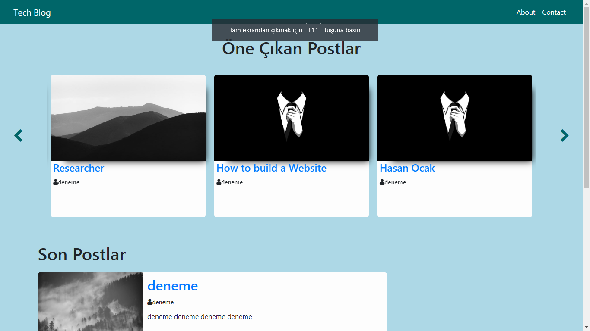

# Django Blog Page

This is a simple blog page project made with django. The models and the structure is basically based on the code in [Django Central](https://djangocentral.com/building-a-blog-application-with-django/). And some of the Html Css codes are based on [Ava Melvine](https://www.youtube.com/channel/UCjOVC0tPIo78a_DNeYs7ETQ)


To use the project 

```bash
git clone https://github.com/ocakhasan/blog_page.git
```
After that make the migrations and create a superuser

```bash
python manage.py makemigrations
python manage.py migrate
python manage.py createsuperuser
```

After that you can simply run the server and access the application.

# Türkçe Açıklama


Bu Python Django ile yapılmış basit bir blog sayfası örnegidir. Buradaki temel yapı ve modeller bu siteden [Django Central](https://djangocentral.com/building-a-blog-application-with-django/) alınmıştır. Bazı Html ve Css kodları da [Ava Melvine](https://www.youtube.com/channel/UCjOVC0tPIo78a_DNeYs7ETQ) buradan alınmıştır

Projeyi kullanmak için 

```bash
git clone https://github.com/ocakhasan/blog_page.git
```
Migrationları yapın ve superuser yaratın

```bash
python manage.py makemigrations
python manage.py migrate
python manage.py createsuperuser
```

Bunlardan sonra kısaca serverı çalıştırıp applicationı görebilirsiniz
```bash
python manage.py runserver
```
